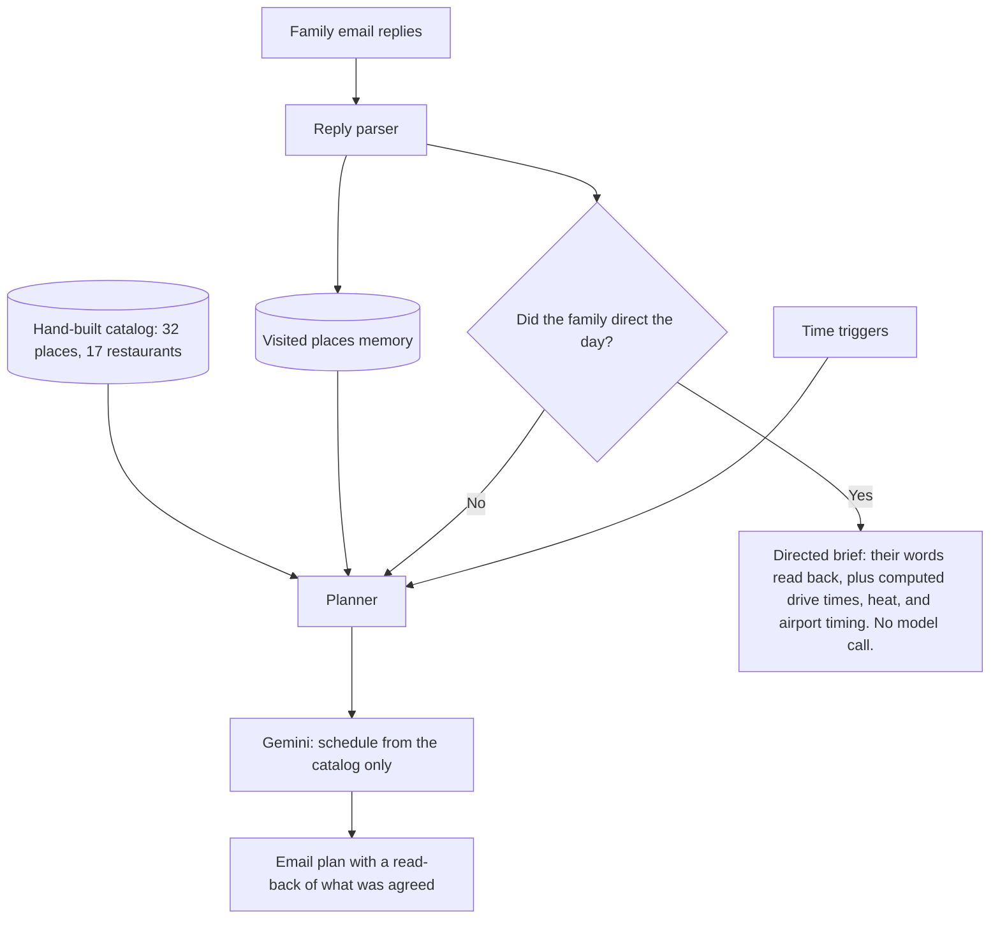

# AI Travel Concierge

A stateful trip-planning assistant built in **Google Apps Script** with **Gemini**. It ran live during a 19-day family trip to Orange County, California in August 2026, planning each day for a multi-generational group that included a one-year-old.

Personal project. It costs nothing to run: it lives inside a Gmail account and used about 5% of the Apps Script quota.

## The problem

Planning a day for a large family group means juggling heat, a toddler's naps and heat limits, drive times, airport runs, and requests that change over breakfast. Doing it by hand every evening is slow, and generic AI travel suggestions invent places, repeat ones already visited, and ignore what the group actually said.

## What it does

| Trigger | Schedule | Job |
|---|---|---|
| Daily brief | 10:00 PM | Plans the following day and emails it to the group |
| Conditions check | 12:00 PM | Compares actual conditions with the forecast the plan was built on, and alerts if the day needs to change |
| Reply watcher | Every 15 minutes, 6:00 AM to 8:00 PM | Reads replies, updates what the group has done, and replans (up to two revisions a day) |
| Survey reminders | 6:00 PM | Collects feedback from the adults in the group |
| Shutdown | After the trip | Every trigger deletes itself when the trip ends |

## Design decisions

1. **Retrieval over generation.** Gemini schedules only from a hand-written catalog of 32 places and 17 restaurants. It cannot invent a venue, so every suggestion is real and every map link resolves.
2. **Constraints beat instructions.** Rather than asking the model not to repeat itself, recently suggested places are removed from what it can see, with an exclusion window that steps down from three days to one.
3. **It learns from replies.** When the family writes that they went somewhere, an alias table and past-tense verb matching add it to a permanent visited list.
4. **Region rest.** A long day in one region rests that region for two days, so the plan does not keep pulling the group back to the same headline attraction.
5. **Hard safety rules for the youngest traveler.** Above 28°C (82°F), outdoor exposure between 11 AM and 4 PM is banned unless the family explicitly asks for it, and each day gets a short, medium, or long budget from the previous night's sleep and the forecast peak heat.
6. **Airport arithmetic is computed, not generated.** Airport drops come last in the day, with two hours for domestic and three for international flights.
7. **Every email reads back what was agreed.** A "What we agreed" header restates the family's latest instructions so a wrong plan is visible at a glance.
8. **No invented links or photos.** Map links are built from catalog names, and each hero photo comes from a hand-mapped Wikipedia title, cached, with a graceful fallback.

## Incident report: a plan that contradicted the family

**What happened.** On day 11, a third same-day replan suggested an area the family had not asked for, while the email's own read-back header correctly restated the area they had requested.

**Root cause.** The anti-repeat window counted the same day's earlier suggestions as places already visited. By the third replan, the places the family had asked for had been suggested earlier that day, so they were hidden from the model.

**Response.** Earlier that day I had set an explicit kill criterion: any sent plan that contradicts a written family instruction, or repeats a visited place, freezes the system to conditions-only emails. It fired. That day was recovered with a deterministic correction email, and the system moved to a hybrid mode instead of a full freeze:

- **Directed days bypass the model entirely.** When the family has said what they want, the email quotes their words back and adds only computed facts: drive times, map links, heat, and airport timing.
- **The model plans only undirected days.**
- **The bug is fixed at the source.** A day's own earlier suggestions no longer count as visits when that day is replanned.

**Lesson.** Patching a model's judgment under live load is the wrong fix. The right fix removes the model from the decisions where the humans have already decided.

## Other engineering notes

- **Gemini 2.5 Flash returned empty plans** because its internal reasoning consumed the output-token budget. Setting the thinking budget to zero fixed it.
- **Revisions carry full context.** Stated times are binding, earlier instructions stay in force, and revisions see the same filtered catalog as the nightly brief.
- **Deployment discipline.** Large code changes were checksum-verified in the editor before saving, and every behavior change was verified by reading the delivered email, not the script log.

## Stack

Google Apps Script (JavaScript) · Gemini API · OpenWeather API (conditions, forecast, air quality) · NOAA tide predictions · Gmail · Google Forms · Wikipedia API · Google Maps links

## About the source code

The full script is about 110,000 characters and contains private family data, so it is not published in full. Selected functions are in [`src/excerpts.gs`](src/excerpts.gs): the trigger schedule, self-shutdown after the trip, the one-reminder survey policy, and a test harness that never mails the family.
